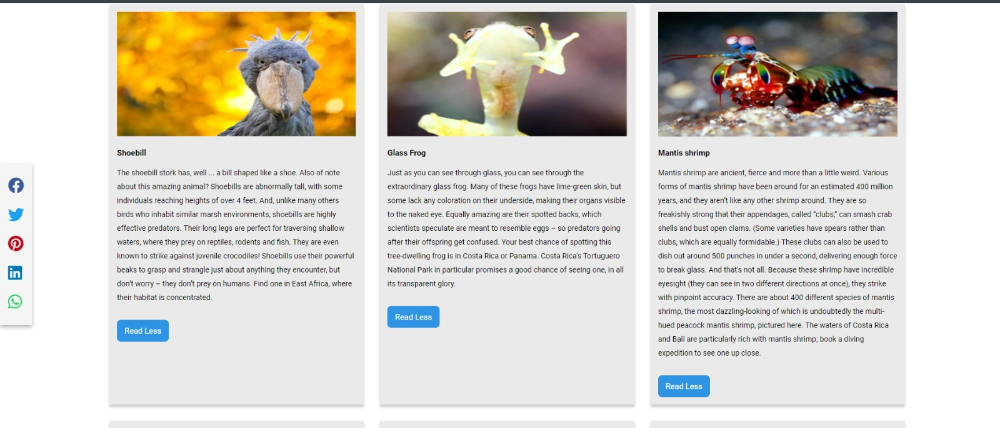

# mysteries

This website will introduce users to the
most strange and interesting things from people
to places and creatures on earth.

## Table of contents

 * [General info](#general-info)
 * [Usage](#usage)
 * [Technologies](#technologies)
 * [Features](#features)
 * [Credits](#credits)
 * [License](#license)

***
## General info

With this website we have created, people can easily access the information they will learn, perhaps
after a long research. On the page they can find a lot of information about interesting places, creatures , people and plants. At the same time, they can share the assets they like on various platforms such as facebook, instagram, twitter, WhatsApp. At the same time, they can send us messages and share their opinions, requests, suggestions or comments with us.

***
## Usage

When the guest clicked the read more button , more information will appear.

admins can be easily reached by using the communication section to make suggestions, send messages or make any complaints. After sending messages and click the "SEND" button , there should be an alert on the screen to confirm that message is received.

---
## Technologies

These are languages and libraries and its version when creating the project.

  * HTML
  * CSS
  * Javascript
  * Font Awesome css 5.15.3
  * Formcarry
  * jquery version: 3.5.1

---

## Features

 1. Sliders that make the photos in the boxes change at certain seconds.
 2. Responsiveness to various devices such as phones, computers, tablets and taking a special shape for each device.
 3. Containers which make boxes tidier.
 4. Share-buttons that help visitors to share the link of our page easily.
 5. responsive navbar and smooth movement in categories section to reach other sections such as (Human, Creatures, plants, places).
***

## Credits
The project is created by those:

* Aiman Najib Ahmed Abdo
* Tarek Shihab
* Zehra Küçükaltun

### These are links of tutorials to built some parts of the project:

- https://www.youtube.com/watch?v=uI18xGocVnw&t=75s

---

## License

* MIT license
